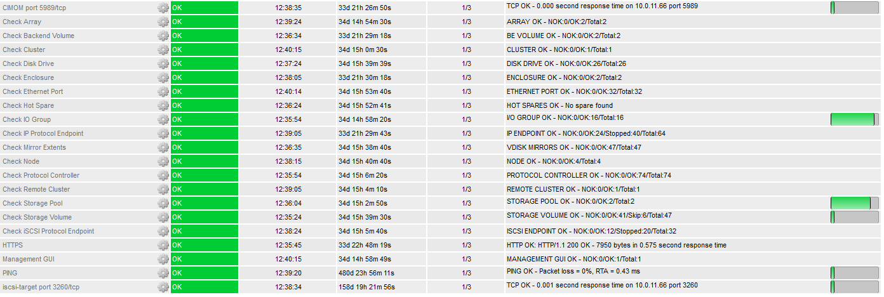

# IBM Storwize & FlashSystem Nagios plugin

## Updated version

IBM Storwize & FlashSystem monitoring check:

- modified for standard Nagios
- supports V7000 (Gen3) and iSCSI
- plugin was tested with Spectrum Virtualize upgrade v8.3.1 (and older) code

Original script was made for "Shinken", a Nagios rewrite. This version is a fork, for more information [see below]( #Original-version).

The .cfg files were adapted to work as best posible with Nagios Core.



**Requirements:**

- open CIM port (TCP/5989) and a WBEM/CIM client ([see below](#README))
- a (nagios) user/password on device, create it first using CLI (mkuser) or GUI

### Script

Get the modfied Perl script only: [libexec/check_ibm_storwize.pl](/libexec/check_ibm_storwize.pl)

### Example

`check_ibm_storwize.pl -H ibm01.example.com -P 123 -u nagios -p <PASSWORD> -C StorageVolume`

### Usage

`check_ibm_storwize.pl -h`

```

IBM Storwize & FlashSystem health status plugin for Nagios.
Needs wbemcli to query the Storwize Arrays CIMOM server.

Usage: check_ibm_storwize.pl [-h] -H host [-P port] -u user -p password -C check [-c crit] [-w warn]

Flags:

    -C check    Check to run. Currently available checks:

                Array, ArrayBasedOnDiskDrive*, BackendVolume, Cluster, ConcreteStoragePool*,
                DiskDrive, Enclosure, EthernetPort, FCPort, IOGroup*, IsSpare, MasterConsole,
                MirrorExtent, Node, QuorumDisk, StorageVolume
                BackendController, BackendTargetSCSIProtocolEndpoint, FCPortStatistics
                ProtocolEndpoint, iSCSIProtocolEndpoint, ProtocolController, RemoteCluster,
                HostCluster

    -h          Print this help message.
    -H host     Hostname of IP of the SVC cluster.
    -P port     CIMOM port on the SVC cluster.
    -p          Password for CIMOM access on the SVC cluster.
    -u          User with CIMOM access on the SVC cluster.
    -c crit     Critical threshold (only for checks with '*')
    -w warn     Warning threshold (only for checks with '*')
    -s skip     Skip element(s) using regular expression
    -b bytes    Do not convert bytes to MiB GiB TiB

```

### Changes

See [CHANGES.md](/CHANGES.md)

---

## Original version

"pack-storwize" by [Forlot Romain](https://github.com/claneys)

### README

Shinken configuration pack for IBM Storwize Vxxxx 
You must install Standard Based Linux Instrumentation package:
- sblim-wbemcli

### Repository

[https://github.com/claneys/pack-storwize](https://github.com/claneys/pack-storwize)

---

## Previous Version

"check_ibm_svc.pl" by [Frank Fegert](https://www.bityard.org/blog/about)

### Blog posts:

- [https://www.bityard.org/blog/2014/12/24/nagios_monitoring_ibm_svc_storwize_update](https://www.bityard.org/blog/2014/12/24/nagios_monitoring_ibm_svc_storwize_update)
- [https://www.bityard.org/blog/2013/12/28/nagios_monitoring_ibm_svc_storwize](https://www.bityard.org/blog/2013/12/28/nagios_monitoring_ibm_svc_storwize)

