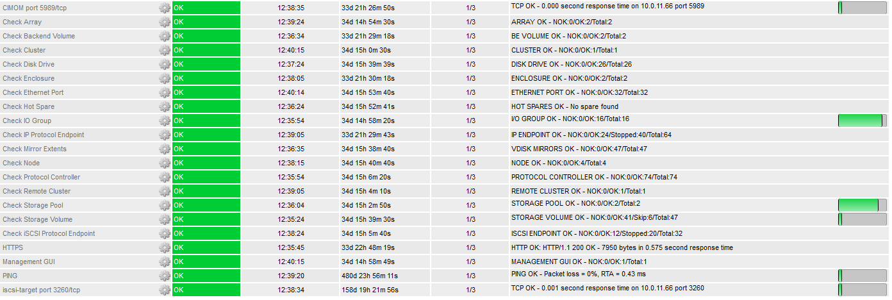

# IBM Storwize and FlashSystem Monitoring plugin

Checks overal health of IBM FlashSystem family devices (formerly Storwize). Includes storage, network and cluster status.

https://en.wikipedia.org/wiki/IBM_FlashSystem

https://en.wikipedia.org/wiki/IBM_Storwize

## Updated version

Main additions and changes:

- script modified for standard Nagios
- supports V7000 (Gen3) and iSCSI
- tested plugin with Spectrum Virtualize upgrade v8.3.1 code (and older)
- template cfg files adapted to work as best posible with Nagios Core
- configurable critical/warning thresholds, with defaults



Original script was made for "Shinken", a Nagios rewrite. This version is a fork, for more information see: [docs/Sources.md](docs/Sources.md).

## Installation

### Requirements

- Nagios, Icinga or other compatible monitoring system
- Perl 5, if it's not already installed  (`apt` or `yum install perl`)
- open CIM port (TCP/5989) and a WBEM/CIM client (`apt` or `yum install sblim-wbemcli`)
- a "monitor" user account to log in to storage device (create in GUI or `mkuser` in CLI)

### Script

The main updated Perl script is located in "libexec" dir. Place it on your Nagios server for example.

If you only want the script, download [libexec/check_ibm_storwize.pl](/libexec/check_ibm_storwize.pl)

#### Example

`check_ibm_storwize.pl -H ibm01.example.com -P 5988 -u nagios -p <PASSWORD> -C StorageVolume`

#### Usage

`check_ibm_storwize.pl -h`

```

IBM Storwize & FlashSystem health status plugin for Nagios (v20221223-mk)
Needs 'wbemcli' to query the Storwize Arrays CIMOM server

Usage: check_ibm_storwize.pl [-h] -H host [-P port] -u user -p password -C check [-c crit] [-w warn]

Flags:

    -C check    Check to run. Currently available checks:

                Array, ArrayBasedOnDiskDrive*, BackendVolume, Cluster, ConcreteStoragePool**,
                DiskDrive, Enclosure, EthernetPort, FCPort, IOGroup*, IsSpare, MasterConsole,
                MirrorExtent, Node, QuorumDisk, StorageVolume**
                BackendController, BackendTargetSCSIProtocolEndpoint, FCPortStatistics
                IPProtocolEndpoint, iSCSIProtocolEndpoint*, ProtocolController*, RemoteCluster,
                HostCluster

    -h          Print this help message
    -H host     Hostname of IP of the SVC cluster
    -P port     CIMOM port on the SVC cluster
    -p          Password for CIMOM access on the SVC cluster
    -u          User with CIMOM access on the SVC cluster
    -c crit     Critical threshold as <n> NOK items or as % (only for checks with '*' or '**')
    -w warn     Warning threshold as <n> NOK items or as % (only for checks with '*' or '**')
    -s skip     Skip element(s) using regular expression
    -b bytes    Do not convert bytes to MiB GiB TiB

```

## Defaults

- CIMON port 5989 (TLS)
- Convert bytes to MiB GiB TiB

Check thresholds:

- ArrayBasedOnDiskDrive Spares: **0** ("no Spare", omit)
- ConcreteStoragePool PhysicalCapacity: WARN at **80**% usage, CRITICAL at **90**% 
- IOGroup FreeMemory: **0** Bytes (omit)
- iSCSIProtocolEndpoint: WARN at **1** port down, **2** or more is CRITICAL
- ProtocolController: WARN at **3** hosts down, **4** or more is CRITICAL
- StorageVolume Capacity: WARN at **85**% usage, CRITICAL at **95**% 

Numbers in **bold** can be changed with `-c` and `-w`. If percentage `-c 100` is set, the plugin will warn only.

These checks will WARN if more than **half** of total items are down:

- BackendVolume, EthernetPort, FCPort

## Nagios templates

All nagios config file examples are now in "[etc](etc/objects)" dir. Use as you see fit.

- etc/objects/commands.cfg (check_commands)
- etc/objects/discovery.cfg (mgmt https check)
- etc/objects/template.cfg (host, user, password)
- etc/objects/timeperiods.cfg (schedule, retries)
- etc/objects/services/*.cfg

## More information

See: [docs/README.md](docs/README.md)
